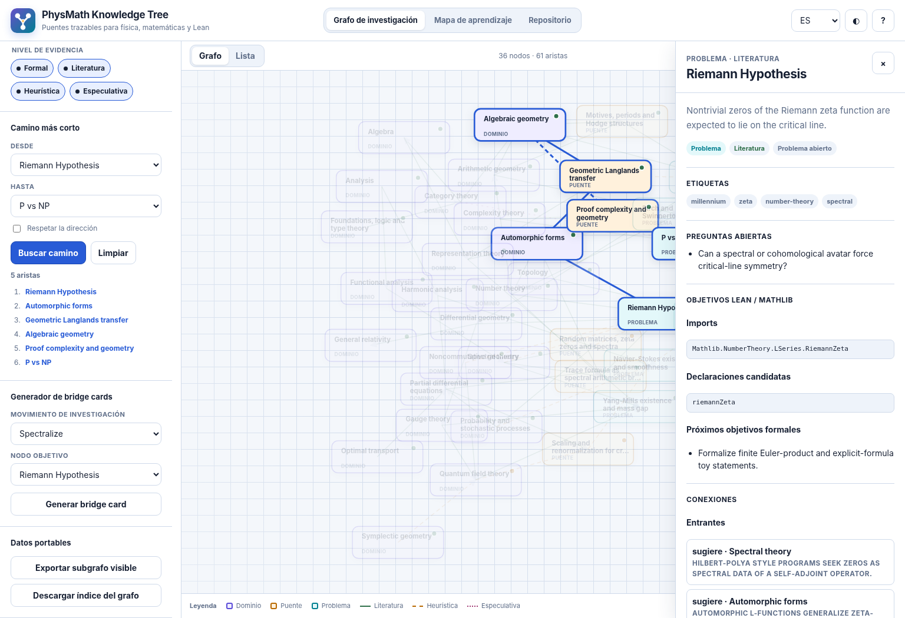

# PhysMath Knowledge Tree

[Versión en español](./README.es.md) · [Live research graph](https://lluiseriksson.github.io/physmath-knowledge-tree/) · [Learning map](https://lluiseriksson.github.io/physmath-knowledge-tree/learning.html) · [Research workbench](https://lluiseriksson.github.io/physmath-knowledge-tree/workbench.html) · [Evidence review](https://lluiseriksson.github.io/physmath-knowledge-tree/evidence.html) · [Change review](https://lluiseriksson.github.io/physmath-knowledge-tree/changes.html) · [Lean target audit](https://lluiseriksson.github.io/physmath-knowledge-tree/formalization.html) · [Research dossiers](https://lluiseriksson.github.io/physmath-knowledge-tree/dossiers.html)

A computable, evidence-labelled graph for exploring connections between physics, mathematics, open problems and Lean formalization targets. The repository also ships a bilingual prerequisite map, local research tools, evidence governance and a reproducible Lean-target audit queue.




## Seven complementary experiences

### Research graph — `index.html`

The research interface reads the canonical JSON graph directly. It includes:

- 58 domain, bridge and problem nodes connected by 112 typed, evidence-labelled edges.
- Search across titles, IDs, tags, summaries and live questions.
- Curated collections, kind/evidence filters, graph and accessible list views.
- Directed or undirected shortest-path search.
- Node dossiers with questions, references, incoming/outgoing mechanisms and Lean targets.
- A bridge-card generator that produces explicitly exploratory Markdown scaffolds.
- Visible-subgraph export, shareable URL state, bilingual UI, dark mode and offline caching.
- Scoped references on all 58 nodes and all 112 edges, with `claim`, `context` and `formalization` distinguished in the schema.

Evidence labels are part of the data model: `formal`, `literature`, `heuristic` and `speculative`. A visual connection is never intended to imply a theorem.

### Research workbench — `workbench.html`

The local-first workbench saves multiple investigations in browser storage. It pins canonical node IDs, compares radius-limited neighborhoods and evidence-aware routes, stores bridge-card drafts, and records structured negative or inconclusive results. Workspace libraries can be validated, merged and exported as JSON without accounts, analytics or remote synchronization.

See [`docs/RESEARCH_WORKBENCH.md`](./docs/RESEARCH_WORKBENCH.md).

### Evidence Review Center — `evidence.html`

The evidence center turns the generated URL registry into a deterministic local review queue. It records checked dates, source class, publication identifiers and follow-up notes without editing canonical confidence or claims. Review ledgers and selected review packets can be validated, merged and exported as JSON.

See [`docs/EVIDENCE_REVIEW_CENTER.md`](./docs/EVIDENCE_REVIEW_CENTER.md).

### Canonical Change Review — `changes.html`

The local change reviewer fingerprints normalized canonical snapshots and compares them against the current graph. It prioritizes confidence promotions, endpoint rewrites, source-bearing reference losses, removals and graph-contract changes; stores bounded local decisions; and exports selected review packets as JSON or Markdown. It never mutates canonical data.

See [`docs/CANONICAL_CHANGE_REVIEW.md`](./docs/CANONICAL_CHANGE_REVIEW.md).

### Lean Target Audit — `formalization.html`

The local audit queue enumerates canonical Lean imports, declaration names and bounded targets. It records toolchain-specific outcomes, supports rename/replacement notes and generates reproducible Lean files containing imports and `#check` commands. Successful compilation checks names only; it never certifies a graph claim.

See [`docs/LEAN_TARGET_AUDIT.md`](./docs/LEAN_TARGET_AUDIT.md).

### Research Dossier Center — `dossiers.html`

The dossier center combines one Workbench campaign with its scoped evidence reviews, Lean-name audits and canonical-change decisions. It computes bounded readiness gates and exports fingerprinted JSON or Markdown handoffs without writing any source ledger or canonical graph file.

See [`docs/RESEARCH_DOSSIER_CENTER.md`](./docs/RESEARCH_DOSSIER_CENTER.md).

### Learning map — `learning.html`

The learning interface contains 90 bilingual topics and 199 prerequisite edges, from arithmetic through advanced mathematics and physics. It provides search, filters, graph/list views, local progress, favorites, readiness recommendations, target paths, JSON import/export and offline support.

## Canonical data

```text
graph/
├── index.json                    # Version, paths, roots and generated statistics
├── nodes/core.json               # Canonical knowledge nodes
├── edges.json                    # Typed claims with mechanisms and confidence
├── research_moves.json           # Reusable hypothesis-generation moves
├── collections.json              # Curated subgraphs
└── schemas/                      # JSON Schema 2020-12 contracts
```

The graph is designed for humans, scripts and research agents. Every node has a stable ID, summary, tags, live questions and one or more bounded Lean targets. Every edge states a mechanism rather than merely asserting that two subjects are “related”.

Generated Markdown projections in `views/` are derived artifacts; JSON remains canonical. [`docs/GRAPH_AUDIT.md`](./docs/GRAPH_AUDIT.md) exposes topology and evidence coverage, while [`graph/reference-registry.json`](./graph/reference-registry.json) provides a deterministic URL-level registry. Current traceability is 58/58 nodes and 112/112 edges with references; every formal/literature item has a `claim` or `formalization` source. Context-only references never promote heuristic or speculative evidence.

## Evaluation and positioning

The repository includes a deterministic evaluation layer rather than relying only on test coverage:

- 14 search regressions with top-1 accuracy, recall@3 and mean reciprocal rank.
- Five directed research-route scenarios with edge budgets, evidence gates, terminal checks and source checks.
- A repository-controlled quality rubric whose exclusions explicitly include scientific truth, publication novelty, external adoption and unfinished user studies.
- A statement of need, related-work comparison, reproducibility guide and preregistered user-evaluation protocol.

See [`docs/EVALUATION.md`](./docs/EVALUATION.md), [`docs/USE_CASES.md`](./docs/USE_CASES.md), [`docs/QUALITY_SCORECARD.md`](./docs/QUALITY_SCORECARD.md), [`docs/STATEMENT_OF_NEED.md`](./docs/STATEMENT_OF_NEED.md), [`docs/RELATED_WORK.md`](./docs/RELATED_WORK.md) and [`docs/LIMITATIONS.md`](./docs/LIMITATIONS.md). Reproduce a case with `npm run usecase:list` and `npm run usecase -- <scenario-id>`.

## Source curation

Raw research TXT, Markdown and PNG files are treated as temporary inbox material. The repository stores SHA-256 provenance, atomic decisions and concise mathematical extracts instead of transcript dumps. See [`docs/CURATION_WORKFLOW.md`](./docs/CURATION_WORKFLOW.md) and [`curation/`](./curation/README.md).

A source becomes deletion-safe only after every unique claim is dispositioned, all destinations validate, the verification queue is closed and `review.status` records explicit user approval.

## Lean package

The Lean spine mirrors the stable ontology without pretending to formalize the underlying research claims:

```text
PhysMathKnowledgeTree/
├── Foundation.lean               # Typed node, edge, evidence and target structures
├── Metadata.lean                 # Schema/repository metadata
├── Bridges/Examples.lean         # Example bridge records
├── Formal/Microtheorems.lean     # Small checked lemmas tied to formal graph nodes
└── Problems/Millennium.lean      # Typed problem cards and calibration case
```

The project is pinned to Lean/mathlib `v4.31.0`.

The formal layer now includes modest but real microtheorems for rate-budget algebra, lattice/physical scaling, target-erasure detection, finite nonselective-operation collapse, rooted child-factorial products and localized homotopy boundary defects. These are proof-bearing toy mechanisms, not claims that the surrounding research programs are solved.

```bash
lake build
```

CI builds the package with warnings treated as failures and checks that the public root import is current.

Candidate graph imports and declaration names can be converted into a bounded probe with `npm run lean:probe`; audit results remain local or portable until deliberately reviewed.

## Run locally

Requirements: Node.js 22 or newer. The web application has no runtime npm dependencies. The complete browser gate also requires Chrome, Chromium or Edge.

```bash
npm ci
npm run dev
```

Open `http://127.0.0.1:4173`.

Run the complete quality gate:

```bash
npm run check
```

Build the GitHub Pages artifact and deterministic SHA-256 manifest:

```bash
npm run build
```

## Commands

| Command | Purpose |
| --- | --- |
| `npm run validate:graph` | Check graph IDs, endpoint integrity, evidence rules, references, collections and index statistics. |
| `npm run validate:curation` | Check source hashes, text ranges, PNG crop regions, review decisions and promoted destinations. |
| `npm run curation:register -- <file> [id]` | Create a draft TXT/Markdown/PNG provenance record without copying the source. |
| `npm run curation:verify-source -- [record] <file>` | Recheck a local original against its recorded hash, size and media metadata. |
| `npm run curation:report` | Regenerate the deletion-gate and verification-queue report. |
| `npm run validate:audit` | Check the generated graph audit and deduplicated reference registry. |
| `npm run evaluate` | Regenerate search, route, evidence and controlled-quality results. |
| `npm run validate:evaluation` | Confirm generated evaluation artifacts match canonical data. |
| `npm run usecase:list` | List committed research-route scenarios. |
| `npm run usecase -- <id>` | Reconstruct one committed research-route scenario. |
| `npm run benchmark:evaluation` | Run a machine-dependent evaluation throughput benchmark. |
| `npm run validate:workflows` | Require explicit permissions and full-SHA pins for external GitHub Actions. |
| `npm run validate:learning` | Check bilingual curriculum taxonomies, prerequisites and DAG structure. |
| `npm run validate:views` | Confirm generated Markdown/Mermaid projections match canonical JSON. |
| `npm run lean:probe -- -- [options]` | Generate a deterministic Lean import/declaration probe from canonical node metadata. |
| `npm run dossier:build -- -- --workspace-file <file>` | Build a fingerprinted integrated research dossier from portable local exports. |
| `npm test` | Run graph, search, layout, path, persistence, server and data tests. |
| `npm run test:coverage` | Enforce 100% line, branch and function coverage for the explicit core module set. |
| `npm run test:e2e` | Exercise research, learning, local-review and Lean-target-audit flows in a real Chromium-family browser. |
| `npm run generate:views` | Regenerate deterministic projections in `views/`. |
| `npm run build` | Produce a deployable static site in `dist/`. |
| `npm run check` | Run syntax, schemas, curation, evaluation, accessibility, full core coverage, reproducible build verification and browser smoke testing. |

## Repository map

```text
.
├── index.html / learning.html / workbench.html / evidence.html / changes.html / formalization.html / dossiers.html  # Seven application surfaces
├── graph/                        # Canonical research graph, schemas and reference registry
├── evaluation/                   # Reproducible scenarios, rubric and generated results
├── PhysMathKnowledgeTree/        # Lean package
├── src/                          # Dependency-free web modules and styles
├── tests/                        # Node test suites
├── scripts/                      # Validators, generator, build and local server
├── views/                        # Generated human-readable projections
├── prompts/                      # Agent discovery, hypothesis and Lean prompts
├── docs/                         # Protocol, curated extracts, architecture and audit notes
├── curation/                     # Source hashes, decisions and deletion-safe provenance
└── .github/                      # CI, CodeQL, Pages, templates and maintenance
```

## Research-agent protocol

Start with [`AGENTS.md`](./AGENTS.md) and [`docs/agent-protocol.md`](./docs/agent-protocol.md). The core rules are:

1. Retrieve the smallest relevant subgraph.
2. Separate sourced facts from graph-supported inferences and new hypotheses.
3. Never promote an evidence label without an auditable reason.
4. Attach a falsifier to every speculative edge.
5. Reduce promising ideas to a finite calculation or bounded Lean target.
6. Record negative results and broken analogies, not only successes.

## Accessibility, privacy and security

All seven applications have keyboard-accessible alternatives to the SVG graph, visible focus states, text labels in addition to color, reduced-motion support and responsive layouts. The built artifact is also exercised by a dependency-free Chromium smoke suite covering critical flows, runtime accessibility invariants and offline fallback; see [`docs/BROWSER_TESTING.md`](./docs/BROWSER_TESTING.md). No analytics, accounts, cookies, remote fonts or third-party runtime scripts are used. Learning progress, research workspaces, evidence/change-review notes, Lean-target audit records and dossier preferences remain in browser storage unless explicitly exported.

The application applies a restrictive Content Security Policy, validates import data, uses no `innerHTML` for canonical graph content and is scanned by CodeQL. See [`SECURITY.md`](./SECURITY.md). The reproducible local results are recorded in [`docs/VERIFICATION.md`](./docs/VERIFICATION.md).

## GitHub Pages

The Pages workflow validates the repository, builds `dist/`, uploads the static artifact and deploys it using least-privilege permissions. In repository settings, select **GitHub Actions** as the Pages source, then push to `main` or run the workflow manually.

## Contributing and attribution

Read [`CONTRIBUTING.md`](./CONTRIBUTING.md) before editing data. Canonical graph changes must include a mechanism, confidence level, Lean target implications and passing tests.

Source code is MIT-licensed. Curated graph/documentation content is available under CC BY 4.0; see [`LICENSE.md`](./LICENSE.md). Citation metadata is in [`CITATION.cff`](./CITATION.cff).

<!-- YANG_MILLS_AGENT_PACK_START -->
## Yang–Mills verified-RG integration

For AI-assisted continuation of the formal Yang–Mills repository, start with
[`integrations/yang-mills/README.md`](integrations/yang-mills/README.md).
The pack provides a live declaration registry, analytic hypothesis frontier,
source map, commit planner, query CLI and 100-point evaluation gate.

```bash
npm run validate:yang-mills
npm run generate:yang-mills
npm run query:yang-mills -- next-commit
```
<!-- YANG_MILLS_AGENT_PACK_END -->
