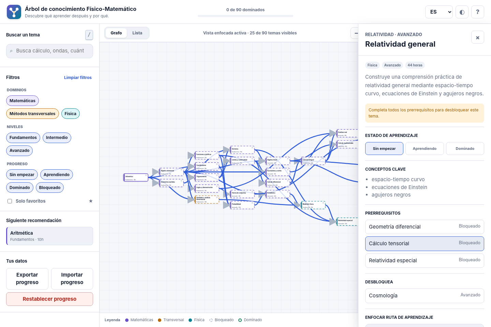

# PhysMath Knowledge Tree

[Versión en español](./README.es.md)

An accessible, bilingual, offline-first prerequisite map for learning mathematics and physics.




## What this repository contains

PhysMath Knowledge Tree turns a curriculum into an interactive directed acyclic graph. Its 90 curated topics connect mathematical foundations, cross-cutting scientific methods, and physics, from arithmetic to quantum field theory and cosmology.

The application has no runtime dependencies or build framework. It runs as standards-based HTML, CSS, SVG, and JavaScript, which keeps the repository easy to audit, quick to load, and inexpensive to maintain.

### Product features

- Interactive prerequisite graph with pan, zoom, fit, search, filters, and a list alternative.
- English and Spanish topic titles, summaries, concepts, and interface text.
- Learning statuses, favorites, readiness checks, recommendations, and target-specific study paths.
- Local progress storage with JSON import and export; no account, analytics, or third-party requests.
- Responsive light and dark themes, keyboard shortcuts, reduced-motion support, and semantic controls.
- Installable progressive web app with an offline application shell.
- Shareable topic and focused-path URLs.

### Engineering features

- Referential-integrity, translation, taxonomy, and cycle validation for the curriculum graph.
- Unit tests for graph traversal, search, recommendations, and progress serialization.
- Local-link, service-worker asset, syntax, and formatting checks.
- Reproducible zero-dependency build into `dist/`.
- GitHub Actions for CI, CodeQL scanning, and GitHub Pages deployment.
- Issue templates, pull-request guidance, Dependabot configuration, security policy, and contribution docs.

## Run locally

Requirements: Node.js 22 or newer. There are no third-party packages to download.

```bash
npm ci
npm run dev
```

Open `http://127.0.0.1:4173`.

Run the complete quality gate:

```bash
npm run check
```

Create the deployable static output:

```bash
npm run build
```

## Commands

| Command | Purpose |
| --- | --- |
| `npm run dev` | Serve the repository locally with security headers and no caching. |
| `npm test` | Run the Node.js test suite. |
| `npm run validate:data` | Validate IDs, translations, taxonomies, prerequisites, and DAG structure. |
| `npm run validate:links` | Check local HTML links and service-worker cache entries. |
| `npm run validate:syntax` | Parse every JavaScript file with Node.js. |
| `npm run validate:format` | Enforce LF endings, final newlines, and no trailing whitespace. |
| `npm run build` | Copy the verified static application to `dist/`. |
| `npm run check` | Run every validation, all tests, and a production build. |

## Repository map

```text
.
├── index.html                    # Accessible application shell
├── src/
│   ├── app.js                    # UI state and interaction orchestration
│   ├── data/topics.js            # Bilingual curriculum and taxonomy
│   ├── lib/                      # Pure graph, search, storage, URL, and DOM modules
│   └── styles.css                # Responsive visual system
├── tests/                        # Node test runner suites
├── scripts/                      # Build, server, and validators
├── assets/icons/                 # PWA and favicon assets
├── docs/                         # Architecture and content authoring guides
├── .github/                      # CI, deployment, security, and contribution automation
├── sw.js                         # Offline application shell
└── manifest.webmanifest          # Installable PWA metadata
```

See [Architecture](./docs/ARCHITECTURE.md) for design decisions and [Content guide](./docs/CONTENT_GUIDE.md) before editing the curriculum.

## Progress data and privacy

Progress is stored only in the browser under a versioned `localStorage` key. Exported JSON is human-readable and validated during import. The app contains no analytics, advertising, cookies, remote fonts, embedded content, or API calls. Clearing site data removes local progress unless it has been exported.

## Accessibility

The graph is an enhancement, not the sole way to navigate the curriculum. Every visible node is keyboard focusable, the list view exposes the same content as ordinary cards, dialogs and drawers have labeled controls, and status is communicated by text rather than color alone. The interface respects the operating system's reduced-motion and color-scheme preferences.

Accessibility changes should be tested with keyboard-only navigation, 200% zoom, and at least one screen reader before merging.

## Deploy to GitHub Pages

1. Open **Settings → Pages** in the repository.
2. Select **GitHub Actions** as the source.
3. Push to `main` or run the `Deploy to GitHub Pages` workflow manually.

The workflow validates the repository, builds `dist/`, uploads it as a Pages artifact, and deploys it with the minimum required permissions.

## Contributing

Read [CONTRIBUTING.md](./CONTRIBUTING.md). Curriculum changes must preserve a valid DAG, include both language variants, and pass `npm run check`.

## License

Released under the [MIT License](./LICENSE).
